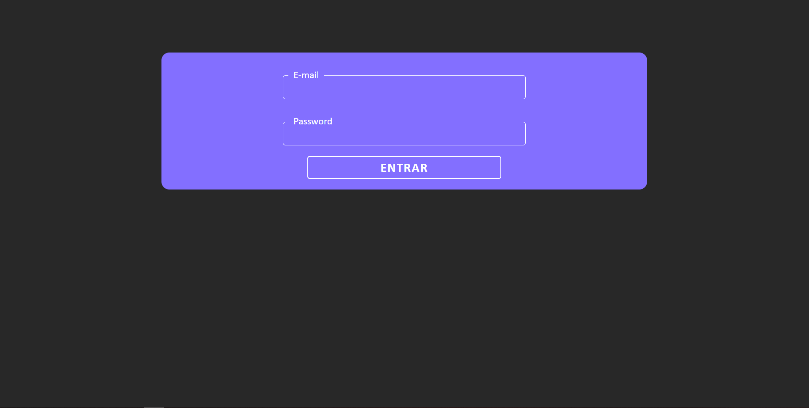
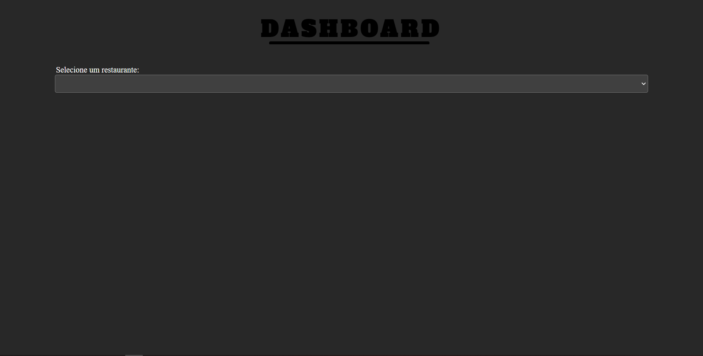
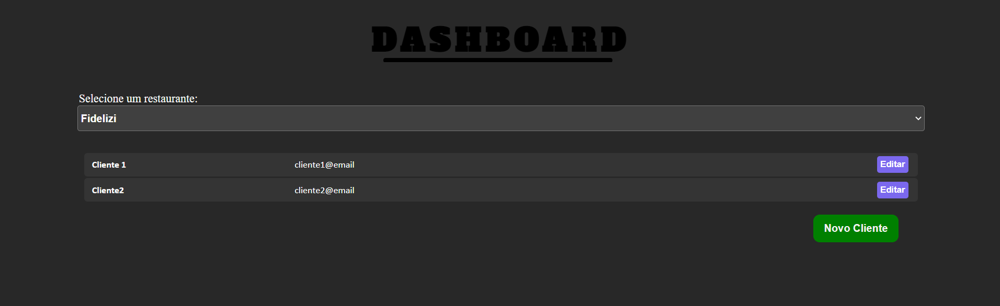
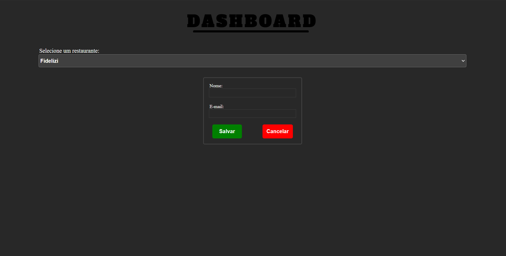

A aplicação é um dashboard criado com ReactJS que consiste em recuperar dados de uma api criada com PHP - Lumen, a fim de conectar clientes à estabelecimentos. 

O primeiro passo é a autenticação do usuário via JWT. Caso o usuário tente acessar a aplicação sem passar pela verificação ou acesse com uma verificação errada, é redirecionado automaticamente à tela de login. 

- Tela de Login: 

Após autenticação feita e reconhecida pela api, a tela inicial é apresentada ao usuário: 

A tela inicial consiste, além do logo, um campo Select para selecionar os estabelecimentos cadastrados. 

Após selecionar o estabelecimento desejado, uma tela com os clientes cadastrados aparece ao usuário e com ele, a possibilidade de adicionar novos clientes. 

Com isso, há a possibilidade do administrador editar os dados dos clientes:

E também, a tela de acrescentar um novo usuário: 

